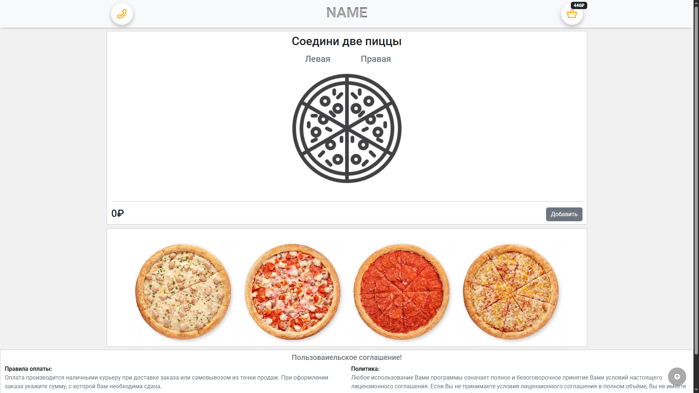
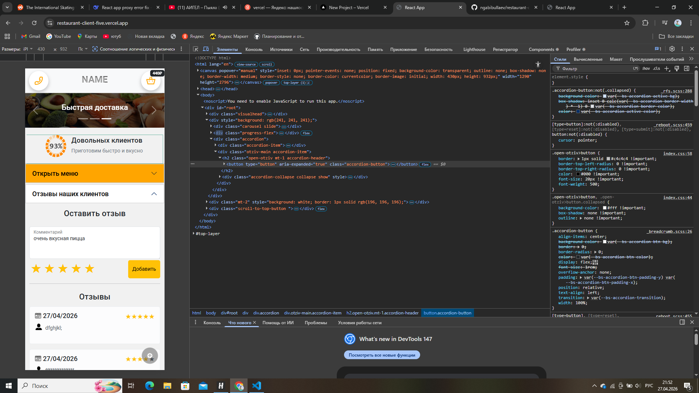

<div align="center">
  
  <h1 align="center">RESTAURANT</h1>
  <p align="center">
    <strong>Крутое React-приложение, для моего партфолио</strong>
  </p>
  <p align="center">
    <a href="https://restaurant-client-five.vercel.app/">
      <strong>🔗 Посмотреть демо</strong>
    </a>
  </p>
</div>

---

## 🦍 О проекте

Это мой пет проект на основе react-pizza. Но я его усовершенствовал. Я добавил комментарии (отзывы). Каждый клиент может оставить свой отзыв. Еще я добавил функцию соединения двух пицц. На момент написания этого проекта а именно 2023 год, еще не было чата гпт, поэтому я с гордостью могу сказать что дописал его лично я. Также я к нему дописал бекенд. Сделал конект с телеграм ботом куда приходят заявки о заказе пицц, добавил файл для хранения отзывов и пользователей. Изменил дизайн



**📌 Основной функционал:**
- 🍕 Соединения двух роловинок пицц
- 🥨 Отзывы и комментарии от клиентов
- 🎨 Связь с телеграм ботом для заказа пицц
- 📱 Полностью адаптивный дизайн



---

## 🛠️ Технологии

<div align="center">
  


</div>

**Библиотеки и инструменты:**
- [React Router DOM](https://reactrouter.com/) — маршрутизация
- [Axios](https://axios-http.com/) — работа с API
- [Redux Toolkit](https://redux-toolkit.js.org/) — работа с API

---

## 🚀 Быстрый старт

### Установка и запуск

```bash
# Клонируйте репозиторий
git clone https://github.com/ngabibullaev/restaurant-client.git

# Перейдите в папку проекта
cd restaurant-client

# Установите зависимости
npm install

# Запустите в режиме разработки
npm start
